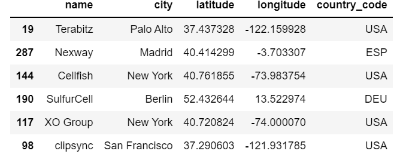
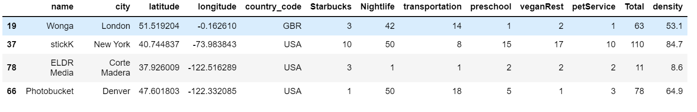
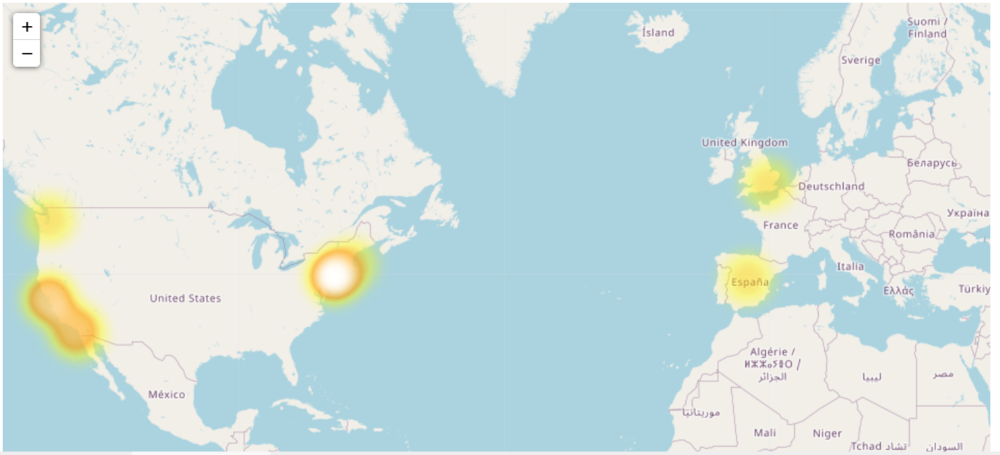
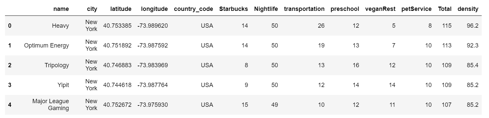
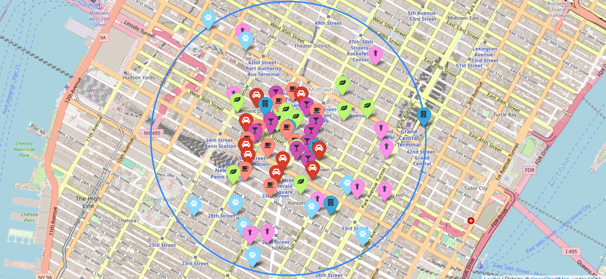

# Poject 3 -Geospatial data
## Selma Laarabi

## Introduction
The goal of this project is to place the new company offices in the best place for the company to grow. we have to find a place that more or less covers all the following requirements 
  - Designers like to go to design talks and share knowledge. There must be some nearby companies that also do design.
  - 30% of the company staff have at least 1 child.
  - Developers like to be near successful tech startups that have raised at least 1 Million dollars.
  - Executives like Starbucks A LOT. Ensure there's a starbucks not too far.
  - Account managers need to travel a lot.
  - Everyone in the company is between 25 and 40, give them some place to go party.
  - The CEO is vegan.
  - The maintenance guy likes a basketball.
  - The office dog—"Dobby" needs a hairdresser every month.

 To achieve this goal we are going to be using a data set from Mongo database, that has a list of companies' coordinates and other...
 this data set is going to be analysed, and from the existing companies, we are going to choose one to steal their current venue, depending on its surroundings.
 
 ## 1. Extracting Data:
**First step of filtering.**

Starting from the "companies" database in Mongo, we are importing only the companies :  
1- that work in anything related to gaming design. etc..  
2- that have total money raised greater than 10M$  

After some cleaning, now we have a data frame with all the potential locations around the globe, that meet some of our requiremenst.(the rest of the criterias are going to be extracted in the second step of filtering).

 ## 2. Transforming Data:
**Second step of filtering.**

For the second filter we are going to be using APi queries from foursquare to narrow down our dataframe, and get a final dataframe with only companies that meet our conditions:  
- We are creating new columns for each amenity we need around our office (with their number of occurrences).  
- We will be deleting any company(coordinates) that has no amenities around.  
- For that matter we will be creating additional column for each amenity with their number of occurrences.
- We are also adding 2 columns, one for total number of amenities, and one we are going to call density, where we use a coefficient to weigh the importance and the priority of each amenity.  

The density column is going to be used later on to choose the the location with the most number of amenities, but first let's use a heatmap to locate the area with the most number of companies, since we want our office to be around successful companies. noting that in our data set we already filtred the companies that have raised more than 10M$.

**It looks like we're going to New York !**

Now, using the density feature, we are going to sort the data set in an descending order, because we are looking for an area with an optimal number of amenities.

Now that we have our data set filtered and saved into a csv file, containing the top 5 locations in New York, we are moving to the last step of the process : Visualization.

 ## 3. Visualization :
 We want our company to be near :   
 
   - Other succesful design companies  
   - Starbucks cafés   
   - Bars   
   - Transportation    
   - School for kids   
   - Vegan restaurants    
   - Pet grooming place    
 and by now we have all that in our clean data frame, which is going to be plotted on a map. 
 
 

## Conclusion :

The optimal location for the our new company's office is here --> The coordinates = ("40.751892", "-73.987592")   

**We are stealing "Optimum Energy" venue!**
